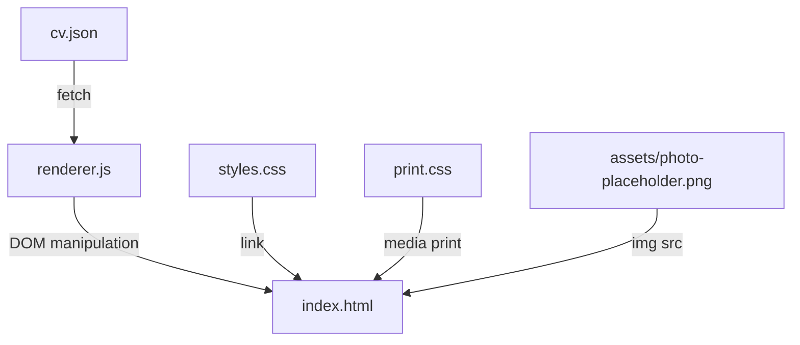

# Design Document: Personal Professional CV

## Overview

This feature renders a personal professional CV from a single JSON data source (`cv.json`) into a semantic HTML page styled with CSS. The renderer is a static, client-side application that fetches the JSON at page load, builds the DOM dynamically, and applies both screen and print stylesheets. No build tool or server-side framework is required — the project runs from a local file server or any static host.

Key design goals:
- **ATS compatibility**: Single-column layout using semantic HTML (`<header>`, `<section>`, `<article>`, `<h1>`–`<h3>`, `<ul>`, `<p>`)
- **PDF export**: `@media print` rules that fit A4, suppress chrome, and avoid page-break mid-entry
- **Content separation**: Zero hardcoded personal data in HTML/JS; everything flows from `cv.json`
- **Maintainability**: Editing the JSON and refreshing the browser is the only update workflow

---

## Architecture



### Runtime Flow

1. Browser loads `index.html` which links `styles.css` and `print.css` and defers `renderer.js`.
2. `renderer.js` fetches `cv.json` via the Fetch API.
3. On success, the renderer parses JSON and calls section-specific builder functions.
4. Each builder creates semantic HTML elements and appends them to a root `<main>` container.
5. On JSON parse error or fetch failure, the renderer displays an error banner instead of partial content.

### Dev Workflow

A lightweight local server (e.g., VS Code Live Server, `npx serve`, or Python `http.server`) serves the files. Editing `cv.json` and refreshing the page shows updates immediately — no build step is needed.

---

## Components and Interfaces

### File Structure

```
cv/
├── index.html              # Shell document with <main id="cv-root">
├── styles.css              # Screen layout, typography, colours
├── print.css               # @media print overrides
├── renderer.js             # Fetch + DOM builder logic
├── cv.json                 # Content model (sole data source)
└── assets/
    └── photo-placeholder.png   # Fallback profile image (200×240 px)
```

### index.html

Minimal shell containing:
- `<meta charset="UTF-8">` and viewport meta
- `<link>` to `styles.css` (screen) and `print.css` (print)
- `<main id="cv-root"></main>` — empty container populated by JS
- `<div id="error-banner" hidden></div>` — shown on load failure
- `<script src="renderer.js" defer></script>`

No personal data appears in the HTML source.

### renderer.js — Module API

```
┌─────────────────────────────────────────────────┐
│  renderer.js                                     │
├─────────────────────────────────────────────────┤
│  main()                                          │
│    → fetchCV(url: string): Promise<CVData>       │
│    → validateCV(data: object): ValidationResult  │
│    → renderCV(data: CVData, root: HTMLElement)    │
├─────────────────────────────────────────────────┤
│  Section Builders (all return HTMLElement)        │
│    buildHeader(header: Header): HTMLElement       │
│    buildSummary(text: string): HTMLElement        │
│    buildWorkExperience(entries: Work[]): HTML     │
│    buildEducation(entries: Edu[]): HTMLElement    │
│    buildTechnicalSkills(cats: Skill[]): HTML      │
│    buildProjects(entries: Project[]): HTMLElement │
│    buildCertifications(entries: Cert[]): HTML     │
│    buildLanguages(entries: Lang[]): HTMLElement   │
│    buildAchievements(entries: Ach[]): HTMLElement │
│    buildReferences(refs: References): HTMLElement │
├─────────────────────────────────────────────────┤
│  Helpers                                         │
│    createElement(tag, attrs, children): Element   │
│    formatDate(dateStr): string                   │
│    wordCount(text): number                       │
│    showError(message): void                      │
└─────────────────────────────────────────────────┘
```

### styles.css — Key Responsibilities

| Concern | Approach |
|---------|----------|
| Layout | Single-column, max-width 210mm (A4), centered |
| Typography | `Inter` (sans-serif) at 11pt base, scale: h1 24pt, h2 16pt, h3 13pt |
| Colour scheme | Dark charcoal text `#2d2d2d` on white `#ffffff`; accent `#1a5276` for headings and links |
| Spacing | 1.5rem between sections, 0.75rem between entries |
| Photo positioning | Flex-start within header; rectangular, object-fit cover; positioned left of the vertical info stack |
| Header layout | Horizontal flex: photo left, vertical stack right (name → title → contact items each on own line with SVG icon) |
| Contact icons | Inline SVG icons (16×16) for phone, email, location, LinkedIn, GitHub, website (globe) |
| Skills | Inline styled tags with border and padding |
| Validation indicators | Orange dashed border + warning icon for missing/invalid fields |

### print.css — Key Responsibilities

| Concern | Approach |
|---------|----------|
| Page size | `@page { size: A4; margin: 15mm; }` |
| Colour | Remove background colours; keep text colour |
| Links | `a[href]::after { content: " (" attr(href) ")"; }` to reveal URLs |
| Page breaks | `break-inside: avoid` on `.work-entry`, `.edu-entry` |
| Hidden elements | Hide error banner, profile photo, any interactive controls |
| Page limit | Rely on compact spacing; `orphans: 2; widows: 2` for text flow |

---

## Data Models

### CVData (TypeScript-style interface for documentation)

```typescript
interface CVData {
  header: Header;
  professionalSummary: string;
  workExperience: WorkEntry[];
  education: EducationEntry[];
  technicalSkills: SkillCategory[];
  projects: ProjectEntry[];
  certifications: CertificationEntry[];
  languages: LanguageEntry[];
  achievements: AchievementEntry[];
  references: References;
}

interface Header {
  fullName: string;
  title: string;           // max 100 chars
  email: string;
  phone: string;           // E.164 format
  city: string;
  country: string;
  linkedIn?: string;       // URL
  github?: string;         // URL
  website?: string;        // URL
  photo: string;           // relative path to PNG
}

interface WorkEntry {
  jobTitle: string;
  company: string;
  startDate: string;       // "YYYY-MM" or "Month YYYY"
  endDate: string | null;  // null → "Present"
  location: string;        // "City, Country" or "Remote"
  bullets: string[];       // 3–6 items
}

interface EducationEntry {
  degree: string;
  institution: string;
  graduationYear: number | null;  // null → "In Progress"
  fieldOfStudy?: string;
  grade?: string;
  description?: string;    // max 150 chars
}

interface SkillCategory {
  category: string;
  skills: string[];        // at least 1; empty → omit category
  obsoleteSkills?: string[]; // rendered after active skills in smaller/muted style
}

interface ProjectEntry {
  name: string;
  description: string;     // 1–3 sentences
  technologies: string[];
  url?: string;
  type: "personal" | "professional";
}

interface CertificationEntry {
  name: string;
  issuer: string;
  year: number;
  expiryYear?: number | null;
  credentialId?: string;
  verificationUrl?: string;
}

interface LanguageEntry {
  name: string;
  proficiency: "Native" | "C2" | "C1" | "B2" | "B1" | "A2" | "A1"
             | "Fluent" | "Conversational" | "Basic";
}

interface AchievementEntry {
  name: string;
  organisation: string;
  year: number;
  impact?: string;
}

interface References {
  mode: "available-upon-request" | "listed";
  entries: ReferenceEntry[];
}

interface ReferenceEntry {
  name: string;
  title: string;
  company: string;
  contact: string;  // email or phone
}

interface ValidationResult {
  valid: boolean;
  warnings: ValidationWarning[];
}

interface ValidationWarning {
  section: string;
  field: string;
  message: string;
}
```

### Validation Rules (enforced at render time)

| Rule | Condition | Visual Indicator |
|------|-----------|-----------------|
| Missing required header field | `fullName`, `email`, or `phone` is empty | Orange placeholder text |
| Summary too long | Word count > 100 | Warning border on summary section |
| Bullet count out of range | `bullets.length < 3 \|\| > 6` | Warning border on work entry |
| Missing dates | `startDate` is empty | Warning icon beside dates |
| Empty skill category | `skills.length === 0` | Category omitted from render |
| Expired certification | `expiryYear < currentYear` | Greyed-out styling + "Expired" label |
| Photo missing | Image fails to load | Swap `src` to `assets/photo-placeholder.png` |
| All project names empty | Every entry has `name === ""` | Projects section omitted entirely |
| All certification names empty | Every entry has `name === ""` | Certifications section omitted entirely |
| All achievement names empty | Every entry has `name === ""` | Achievements section omitted entirely |
| All reference names empty (listed mode) | Every entry has `name === ""` | References section omitted entirely |
| References mode and entries empty | `mode === ""` and `entries.length === 0` | References section omitted entirely |

---


## Correctness Properties

*A property is a characteristic or behavior that should hold true across all valid executions of a system — essentially, a formal statement about what the system should do. Properties serve as the bridge between human-readable specifications and machine-verifiable correctness guarantees.*

### Property 1: Section ordering is correct and complete

*For any* valid CVData object (with any combination of optional sections present or absent), the rendered DOM sections SHALL appear in the order: Header → Professional Summary → Work Experience → Technical Skills → Education → Projects → Certifications → Languages → Achievements (if present) → References (if present) → Driver's Licence (if present, always last). All section headings SHALL use standard recognised labels.

**Validates: Requirements 1.1, 1.2, 1.9, 1.10, 13.4**

### Property 2: Date-ordered sections maintain reverse chronological order

*For any* array of entries in Work Experience, Education, Certifications, or Achievements with varying dates/years, the rendered order SHALL be reverse chronological (most recent first).

**Validates: Requirements 4.1, 5.1, 8.4, 10.3**

### Property 3: All required fields of every entry type are rendered

*For any* entry in any section (work experience, education, project, certification, language, achievement, or reference), every required field defined in the data model SHALL appear as text content in the rendered HTML element for that entry.

**Validates: Requirements 4.2, 5.2, 7.2, 8.1, 9.1, 10.1, 11.1**

### Property 4: Hyperlinks match source URLs exactly

*For any* URL field present in the CVData (email as mailto, LinkedIn, GitHub, website, project URL, verification URL), the rendered anchor element's `href` attribute SHALL equal the source value exactly (with `mailto:` prefix for email).

**Validates: Requirements 2.3, 2.6, 2.7, 2.8, 7.3, 8.3**

### Property 5: Null dates render as substitution text

*For any* Work Experience entry where `endDate` is null, the rendered output SHALL display "Present". *For any* Education entry where `graduationYear` is null, the rendered output SHALL display "In Progress".

**Validates: Requirements 4.5, 5.5**

### Property 6: Validation warnings appear for invalid data

*For any* CVData where a required header field (fullName, email, phone) is empty, OR a work entry has an empty startDate, OR a work entry has fewer than 3 or more than 6 bullet points, OR the professional summary exceeds 100 words, the renderer SHALL apply a visible validation indicator (CSS warning class) to the affected element.

**Validates: Requirements 2.10, 3.5, 4.3, 4.6, 4.7**

### Property 7: Empty skill categories are omitted from output

*For any* SkillCategory where the `skills` array is empty, the renderer SHALL NOT produce any DOM element for that category.

**Validates: Requirements 6.6**

### Property 8: Expired certifications are visually distinguished

*For any* CertificationEntry where `expiryYear` is non-null and less than the current year, the rendered element SHALL have a distinct visual style (e.g., "expired" CSS class) differentiating it from active certifications.

**Validates: Requirements 8.5**

### Property 9: Photo fallback on load failure

*For any* Header where the `photo` path references a file that fails to load, the rendered `` element SHALL have its `src` attribute set to `assets/photo-placeholder.png`.

**Validates: Requirements 2.13**

### Property 10: Semantic HTML structure without tables

*For any* valid CVData, the rendered output SHALL use semantic elements (`<header>`, `<section>`, `<article>`, `<h1>`–`<h3>`, `<ul>`, `<p>`) for structure and SHALL NOT contain `<table>` elements or CSS multi-column layout properties on content sections.

**Validates: Requirements 13.1, 13.2**

### Property 11: Content round-trip fidelity

*For any* valid CVData object, every text value in the data model (names, titles, descriptions, skill names, etc.) SHALL appear verbatim in the rendered HTML text content of the corresponding section.

**Validates: Requirements 15.3**

### Property 12: Malformed JSON produces error display

*For any* string that is not valid JSON, the renderer SHALL display an error banner and SHALL NOT render any CV section content.

**Validates: Requirements 15.5**

### Property 13: References mode determines rendering

*For any* References object, WHEN `mode` is "available-upon-request" the renderer SHALL display the text "Available upon request" and SHALL NOT render individual entries. WHEN `mode` is "listed" the renderer SHALL render each entry with name, title, company, and contact.

**Validates: Requirements 11.2**

### Property 14: Native language listed first

*For any* languages array containing an entry with proficiency "Native", that entry SHALL be rendered first in the languages section regardless of its position in the source array.

**Validates: Requirements 9.2**

---

## Error Handling

### JSON Fetch Errors

| Scenario | Behaviour |
|----------|-----------|
| Network error / file not found | Display error banner: "Unable to load CV data. Check that cv.json exists and the page is served over HTTP." |
| HTTP 4xx/5xx | Display error banner with status code |
| JSON parse error | Display error banner: "cv.json contains invalid JSON. Please fix syntax errors." |
| Empty response | Display error banner: "cv.json is empty." |

### Data Validation Errors (non-fatal)

These do NOT block rendering — the CV renders with visual indicators:

| Scenario | Indicator |
|----------|-----------|
| Missing `fullName`, `email`, or `phone` | Orange placeholder text in header (e.g., "[Full Name Required]") |
| Work entry missing `startDate` | Orange warning icon beside date range |
| Work entry with <3 or >6 bullets | Orange dashed border around entry |
| Professional summary >100 words | Orange dashed border around summary |
| Photo fails to load | `onerror` handler swaps to placeholder PNG |
| Expired certification | Grey text + "Expired" badge |

### Image Load Error

The profile `` element uses an `onerror` handler:
```javascript
imgElement.onerror = () => {
  imgElement.src = 'assets/photo-placeholder.png';
  imgElement.onerror = null; // prevent infinite loop
};
```

---

## Testing Strategy

### Unit Tests (example-based)

Framework: Any lightweight test runner (e.g., Vitest or Jest with jsdom).

| Test Area | Examples |
|-----------|----------|
| `wordCount()` helper | "hello world" → 2, empty string → 0, extra spaces → correct count |
| `formatDate()` helper | "2023-01" → "Jan 2023", null → "Present" |
| CSS contrast ratio | Verify `#2d2d2d` on `#ffffff` ≥ 4.5:1 |
| `@page` rule | A4 size and 15mm margins present |
| `break-inside: avoid` | Applied to work and education entry classes |
| Photo CSS | No `border-radius: 50%`; position rules match spec |
| `a[href]::after` print rule | Present in print.css |
| index.html has no hardcoded data | Source contains no name/email/phone literals |

### Property-Based Tests

Framework: **fast-check** (JavaScript property-based testing library)

Configuration:
- Minimum 100 iterations per property
- Each test tagged with: `Feature: personal-professional-cv, Property {N}: {title}`

| Property # | Test Description | Generator |
|------------|-----------------|-----------|
| 1 | Section ordering | Random CVData with optional sections toggled |
| 2 | Reverse chronological | Random date arrays for each section |
| 3 | Required fields rendered | Random entries for each section type |
| 4 | Hyperlinks match source | Random URL strings |
| 5 | Null date substitution | Work/education entries with null dates |
| 6 | Validation warnings | CVData with intentionally invalid fields |
| 7 | Empty category omitted | Skill categories with empty/non-empty arrays |
| 8 | Expired cert distinction | Certifications with past/future expiry years |
| 9 | Photo fallback | Headers with invalid photo paths |
| 10 | Semantic HTML | Random CVData, inspect DOM tag names |
| 11 | Content round-trip | Random CVData, verify text in rendered output |
| 12 | Malformed JSON error | Random non-JSON strings |
| 13 | References mode | References with both modes |
| 14 | Native language first | Language arrays with various proficiency orderings |

### Integration / Manual Tests

| Test | Method |
|------|--------|
| PDF export fits A4 2-page max | Browser print preview with sample data |
| Print hides interactive elements | Visual inspection of print preview |
| Live Server workflow | Edit cv.json → refresh → verify update |
| Placeholder photo displays | Remove referenced photo → reload |
| WCAG contrast | Browser DevTools accessibility audit |

### Test Environment

- **DOM**: jsdom (via Vitest/Jest) for unit and property tests
- **Assertions**: Standard expect/assert
- **Generators**: fast-check arbitraries for CVData, entries, strings, URLs
- **CI**: Property tests run in CI with 100 iterations; no external dependencies needed

---
